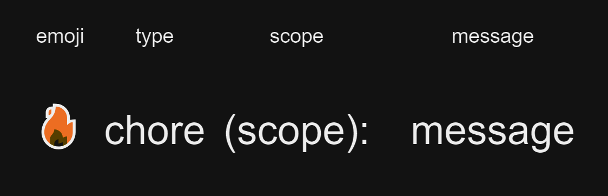

# Contributing to Azure DevOps AI Pipeline

Thank you for your interest in contributing to our project! This document provides guidelines and instructions for contributing.

## Bug Reports

If you encounter any bugs, please report them [here](https://github.com/Serviceware/azure-devops-ai-pipeline/issues). Your reports help us improve the project.

## Coding Guidelines

### Naming Conventions

Please follow these naming conventions:

- Folders: camelCase (e.g., `myFolder`)
- TypeScript files: camelCase (e.g., `myFile.ts`)
- Test files: camelCase (e.g., `myFile.test.ts`)

### Pull Request Policies

When creating a Pull Request, ensure that:

- Your code is formatted with Prettier
- Lint checks complete without errors
- Your commit message is signed off
- All tests pass
- Typescript compilation completes without errors

### Development Commands

Here are some useful npm scripts:

1. Run the task for development: `npm run dev`
2. Run unit tests: `npm run build` and `npm run test`
3. Format code: `npm run prettier:format`
4. Run lint: `npm run lint`

### Changesets

We use Changesets to automate the process of generating release notes and increase the package version. It groups related changes into a single release and generates a changelog based on the changesets you create.

### Conventional Commits

We follow the Conventional Commits specification for commit messages. This structured format ensures a consistent commit history and simplifies release note generation.

For more information, refer to the [official Conventional Commits documentation](https://www.conventionalcommits.org/).

### Husky

We use Husky to enforce commit message format. It runs a script to validate your commit message during the pre-commit hook. If the message doesn't follow the Conventional Commits format, the commit is aborted.

For more information, refer to the [official Husky documentation](https://typicode.github.io/husky/#/).

### Commitlint

Commitlint works with Husky to enforce the Conventional Commits format.

### OpenCommit

OpenCommit is an optional tool that automates commit message creation in the Conventional Commits format. It helps maintain a consistent commit history.

To use OpenCommit, follow the instructions in the [OpenCommit GitHub README](https://github.com/di-sukharev/opencommit). Once configured, you can format your code, generate the changeset, and commit and push changes with `npm run commit`.
